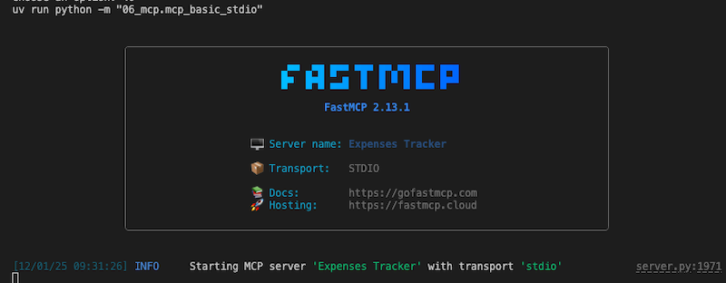

# MCP Examples

## Index

- [In STDIO mode](#run-inpection-in-stdio-mode)
  - [Run the MCP server](#1-run-the-mcp-server)
  - [Run the inspector](#2-run-the-inspector)
  - [Open the inspector in your browser](#3-open-the-inspector-in-your-browser)
  - [Use the inspector to interact with the MCP server](#4-use-the-inspector-to-interact-with-the-mcp-server)
- [In HTTP mode](#run-inpection-in-http-mode)
  - [Run the MCP server](#1-run-the-mcp-server-1)
  - [Run LangChain MCP client](#2-run-langchain-mcp-client)
  - [Run the inspector](#3-run-the-inspector)
  - [Open the inspector in your browser](#4-open-the-inspector-in-your-browser)
- [In SEE mode](#run-inpection-in-see-mode)
  - [Run the MCP server](#1-run-the-mcp-server-2)
  - [Run LangChain MCP client](#2-run-langchain-mcp-client)
  - [Run the inspector](#3-run-the-inspector)
  - [Open the inspector in your browser](#4-open-the-inspector-in-your-browser)
  - [Use the inspector to interact with the MCP server](#5-use-the-inspector-to-interact-with-the-mcp-server)

## Run Inpection in STDIO mode

### 1. Run the MCP server

```bash
uv run python -m 06_mcp.mcp_basic_stdio
```



### 2. Run the inspector

```bash
npx @modelcontextprotocol/inspector .venv/bin/python 06_mcp/mcp_basic_stdio.py
```


### 3. Open the inspector in your browser

* Copy the url with token from the inspector run
* Paster the url in your browser
* Ensure:
  * Transport is set to STDIO
  * Command is set to .venv/bin/python
  * Arguments is set to 06_mcp/mcp_basic_stdio.py
  * Proxy Session Token is set to the token from the inspector run
* Click on "Connect"


### 4. Use the inspector to interact with the MCP server


## Run Inpection in HTTP mode

### 1. Run the MCP server

```bash
uv run python -m 06_mcp.mcp_basic_http
```


### 2. Run LangChain MCP client

```bash
uv run python -m 06_mcp.mcp_langchain_client_http
```

 

### 3. Run the inspector

```bash
npx @modelcontextprotocol/inspector http://localhost:8000/mcp
```


### 4. Open the inspector in your browser

* Copy the url with token from the inspector run
* Paster the url in your browser
* Ensure:
  * Transport is set to Streamable HTTP
  * Transport URL is set to http://localhost:8000/mcp
  * Proxy Session Token is set to the token from the inspector run
* Click on "Connect"


## Run Inpection in SEE mode

### 1. Run the MCP server

```bash
uv run python -m 06_mcp.mcp_basic_sse
```


### 2. Run LangChain MCP client

```bash
uv run python -m 06_mcp.mcp_langchain_client_sse
```

 

### 3. Run the inspector

```bash 
npx @modelcontextprotocol/inspector http://localhost:8000/mcp
```


### 4. Open the inspector in your browser

* Copy the url with token from the inspector run
* Paster the url in your browser
* Ensure:
  * Transport is set to SSE
  * Transport URL is set to http://localhost:8000/sse
  * Proxy Session Token is set to the token from the inspector run
* Click on "Connect"


