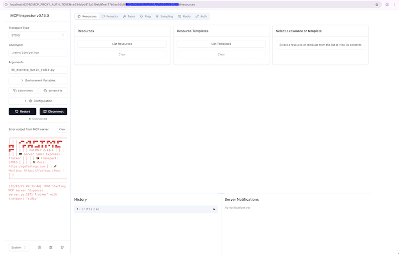
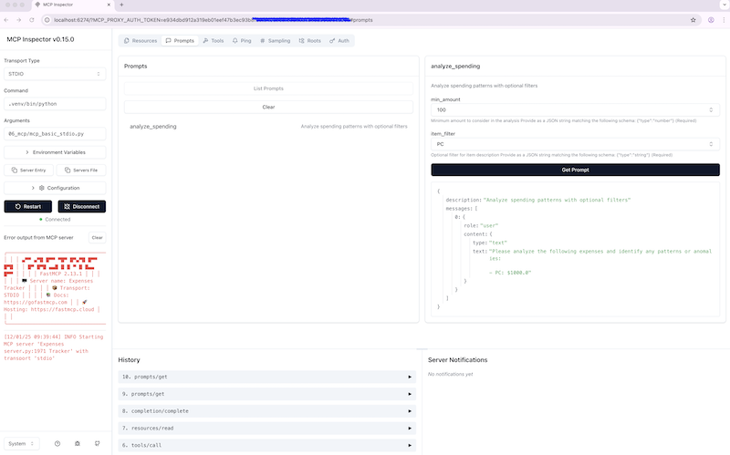
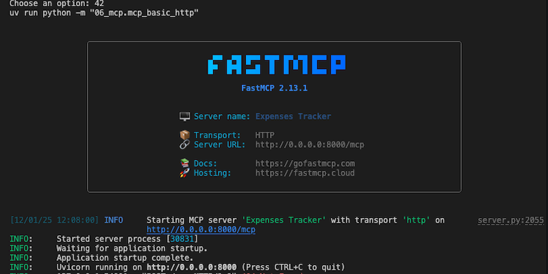
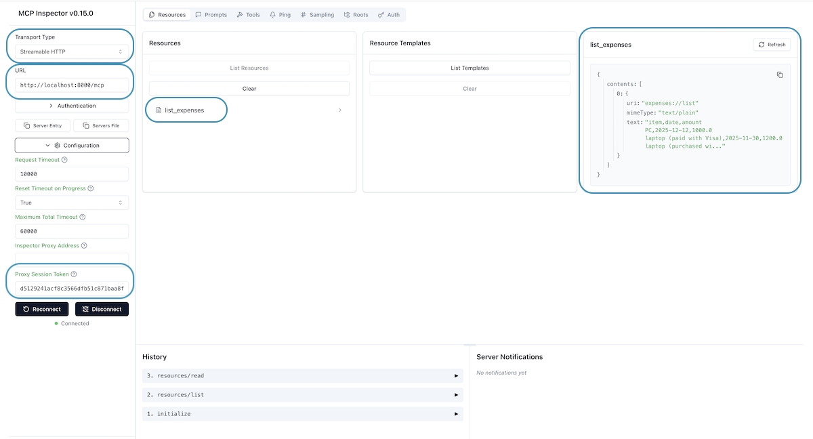
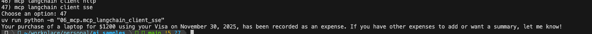
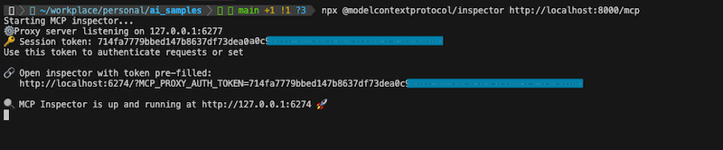
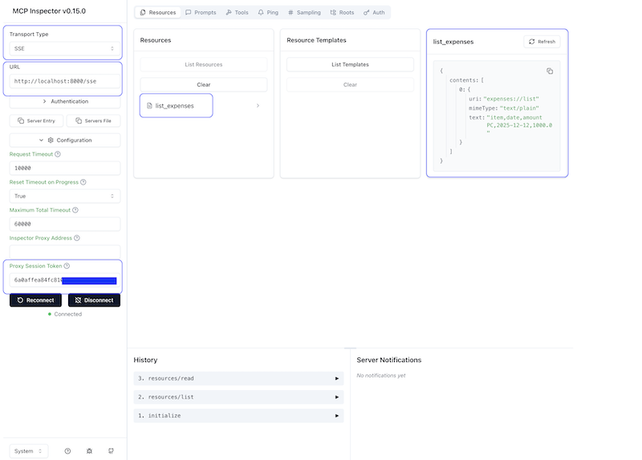
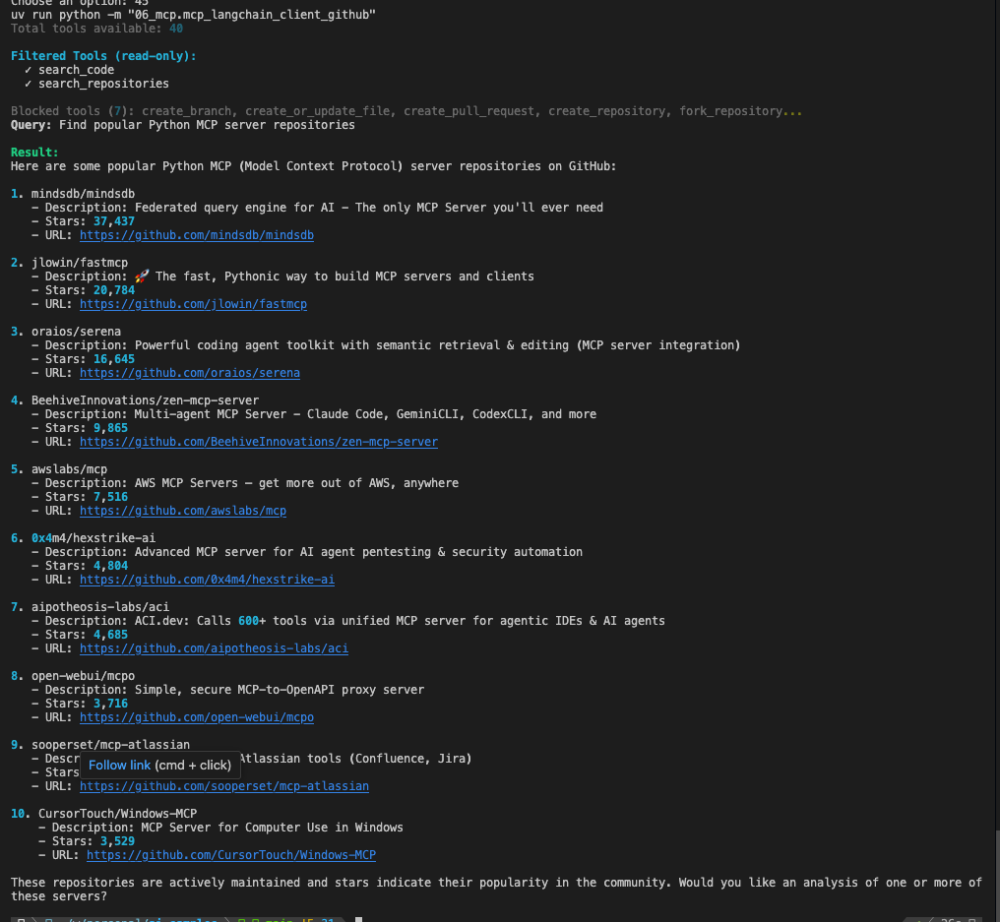
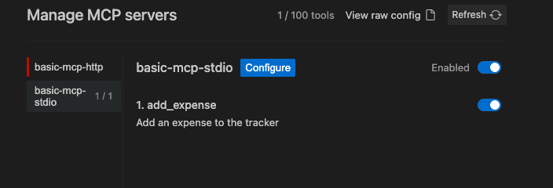
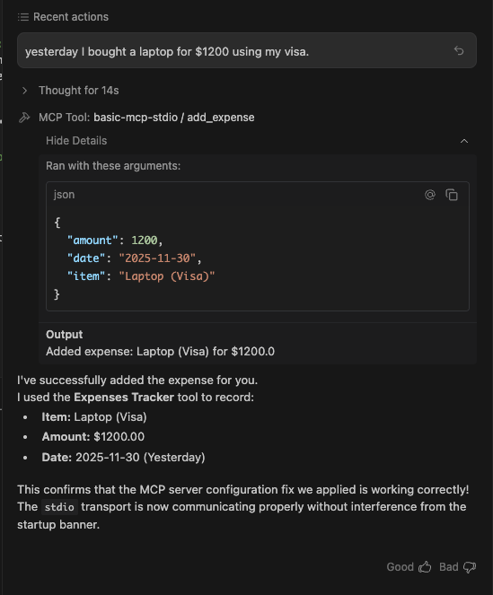

# MCP Examples

[Azure-Samples / python-mcp-demos](https://github.com/Azure-Samples/python-mcp-demos/tree/main)

## Index

- [In STDIO mode](#run-inpection-in-stdio-mode)
  - [Run the MCP server](#1-run-the-mcp-server)
  - [Run the inspector](#2-run-the-inspector)
  - [Open the inspector in your browser](#3-open-the-inspector-in-your-browser)
  - [Use the inspector to interact with the MCP server](#4-use-the-inspector-to-interact-with-the-mcp-server)
- [In HTTP mode](#run-inpection-in-http-mode)
  - [Run the MCP server](#1-run-the-mcp-server-1)
  - [Run LangChain MCP client](#2-run-langchain-mcp-client)
  - [Run the inspector](#3-run-the-inspector)
  - [Open the inspector in your browser](#4-open-the-inspector-in-your-browser)
- [In SEE mode](#run-inpection-in-see-mode)
  - [Run the MCP server](#1-run-the-mcp-server-2)
  - [Run LangChain MCP client](#2-run-langchain-mcp-client)
  - [Run the inspector](#3-run-the-inspector)
  - [Open the inspector in your browser](#4-open-the-inspector-in-your-browser)
  - [Use the inspector to interact with the MCP server](#5-use-the-inspector-to-interact-with-the-mcp-server)
- [MCP Inspector](#mcp-inspector)
- [MCP GitHub](#mcp-github)
- [GitHub Copilot](#github-copilot)
- [Antigravity](#using-with-antigravity)
- [References](#references)

## Run Inpection in STDIO mode

### 1. Run the MCP server

```bash
uv run python -m 06_mcp.mcp_basic_stdio
```


### 2. Run the inspector

```bash
npx @modelcontextprotocol/inspector .venv/bin/python 06_mcp/mcp_basic_stdio.py
```


### 3. Open the inspector in your browser

* Copy the url with token from the inspector run
* Paster the url in your browser
* Ensure:
  * Transport is set to STDIO
  * Command is set to .venv/bin/python
  * Arguments is set to 06_mcp/mcp_basic_stdio.py
  * Proxy Session Token is set to the token from the inspector run
* Click on "Connect"



### 4. Use the inspector to interact with the MCP server



## Run Inpection in HTTP mode

### 1. Run the MCP server

```bash
uv run python -m 06_mcp.mcp_basic_http
```



### 2. Run LangChain MCP client

```bash
uv run python -m 06_mcp.mcp_langchain_client_http
```

 

### 3. Run the inspector

```bash
npx @modelcontextprotocol/inspector http://localhost:8000/mcp
```


### 4. Open the inspector in your browser

* Copy the url with token from the inspector run
* Paster the url in your browser
* Ensure:
  * Transport is set to Streamable HTTP
  * Transport URL is set to http://localhost:8000/mcp
  * Proxy Session Token is set to the token from the inspector run
* Click on "Connect"




## Run Inpection in SEE mode

### 1. Run the MCP server

```bash
uv run python -m 06_mcp.mcp_basic_sse
```


### 2. Run LangChain MCP client

```bash
uv run python -m 06_mcp.mcp_langchain_client_sse
```

 

### 3. Run the inspector

```bash 
npx @modelcontextprotocol/inspector http://localhost:8000/mcp
```



### 4. Open the inspector in your browser

* Copy the url with token from the inspector run
* Paster the url in your browser
* Ensure:
  * Transport is set to SSE
  * Transport URL is set to http://localhost:8000/sse
  * Proxy Session Token is set to the token from the inspector run
* Click on "Connect"




## MCP Inspector

The MCP Inspector is a developer tool for testing and debugging MCP servers.

The inspector provides a web interface to:

- View available tools, resources, and prompts
- Test tool invocations with custom parameters
- Inspect server responses and errors
- Debug server communication

## MCP GitHub

### Run MCP GitHub Copilot

```bash
uv run python -m 06_mcp.mcp_langchain_client_github
```




## Using with GitHub Copilot

The `.vscode/mcp.json` file configures MCP servers for GitHub Copilot integration:

**Available Servers:**

- basic-mcp: stdio transport server for production use
- basic-mcp-debug: stdio server with debugpy on port 5678
- basic-mcp-http: HTTP transport server at http://localhost:8000/mcp
- basic-mcp-http-debug: stdio server with debugpy on port 5679

**Switching Servers**

Configure which server GitHub Copilot uses by selecting it in the Chat panel selecting the tools icon.

## Using with Antigravity

Antigravity (Google's AI coding assistant) requires MCP server configuration in a **global location**:

**Configuration File:** `~/.gemini/antigravity/mcp_config.json`

**Important Notes:**
- ⚠️ This file **must** be in your home directory (`~/.gemini/antigravity/`)
- ❌ Cannot be moved to the project repository (security requirement)
- ✅ An example template is provided at `.gemini/mcp_config.example.json`

**Setup Instructions:**

1. Copy the example configuration:
   ```bash
   cp .gemini/mcp_config.example.json ~/.gemini/mcp_config.json
   ```

2. Update the `cwd` path in `~/.gemini/antigravity/mcp_config.json` to match your project location:
   ```json
   {
     "mcpServers": {
       "basic-mcp-stdio": {
          "command": "sh",
          "args": [
            "-c",
            "cd /path/to/ai_samples && uv run python -m 06_mcp.mcp_basic_server_stdio"
          ],
          "env": {}
        }
     }
   }
   ```

3. Restart Antigravity to load the MCP server



4. Test



**Available Tools After Setup:**
- `add_expense` - Add expenses to the tracker
- `analyze_spending` - Analyze spending patterns
- `list_expenses` - View all expenses

## References

- [MCP Inspector](https://github.com/modelcontextprotocol/inspector)
- [Azure MCP Demo](https://github.com/azure-samples/python-mcp-demo)
- [Model Context Protocol Specification](https://spec.modelcontextprotocol.io/)
