# Azure (Microsoft Entra ID) OAuth 🤝 FastMCP

[Azure (Microsoft Entra ID) OAuth 🤝 FastMCP](https://gofastmcp.com/integrations/azure)

## Step 1: Create an Azure App Registration

Create an App registration in Azure Portal to get the credentials needed for authentication:

1. Navigate to App registrations
    - Go to the Azure Portal and navigate to Microsoft Entra ID → App registrations.
    - Click “New registration” to create a new application.
2. Configure Your Application
    - Fill in the application details:
        - Name: Choose a name users will recognize (e.g., “My FastMCP Server”)
        - Supported account types: Choose based on your needs:
            - Single tenant: Only users in your organization
            - Multitenant: Users in any Microsoft Entra directory
            - Multitenant + personal accounts: Any Microsoft account
        - Redirect URI: Select “Web” and enter your server URL + /auth/callback (e.g., http://localhost:8000/auth/callback)
        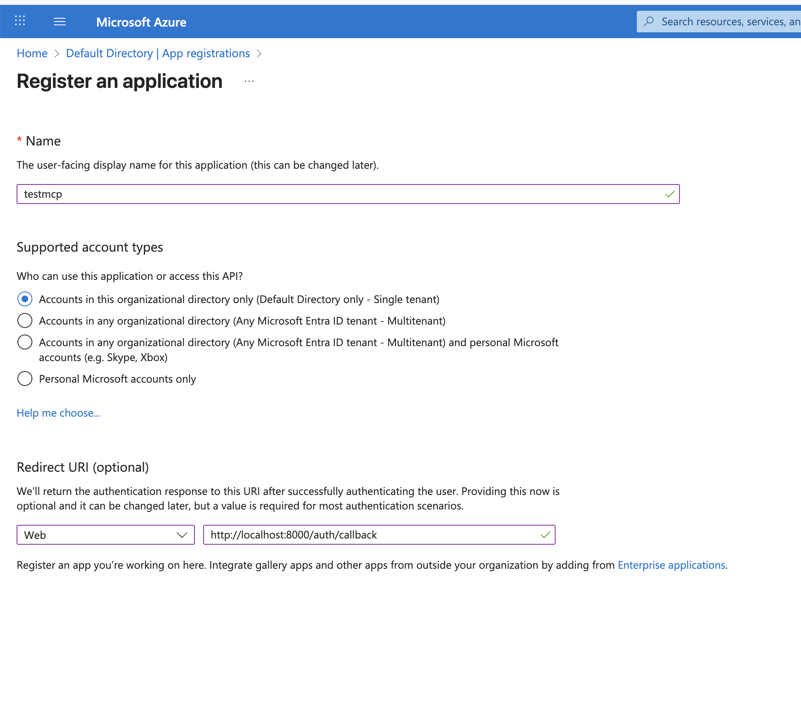
        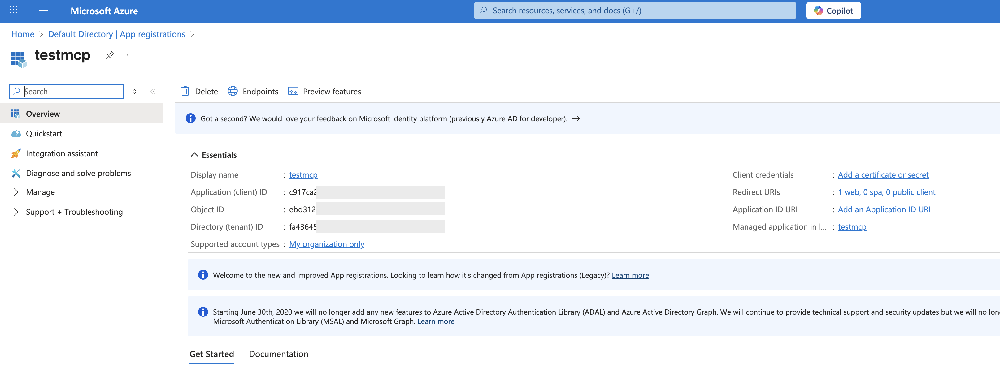

        - Expose an API: Configure your Application ID URI and define scopes
            - Go to Expose an API in the App registration sidebar.
            - Click Set next to “Application ID URI” and choose one of:
                - Keep the default api://{client_id}
                - Set a custom value, following the supported formats (see Identifier URI restrictions)
            - Click Add a scope and create a scope your app will require, for example:
                - Scope name: read (or write, etc.)
                - Admin consent display name/description: as appropriate for your org
                - Who can consent: as needed (Admins only or Admins and users)
                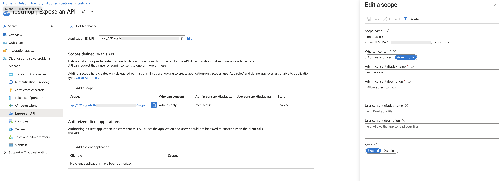
            - Configure Access Token Version: Ensure your app uses access token v2
                - Go to Manifest in the App registration sidebar.
                - Find the requestedAccessTokenVersion property and set it to 2:
                ```json
                    "api": {
                        "requestedAccessTokenVersion": 2
                    }
                ```
                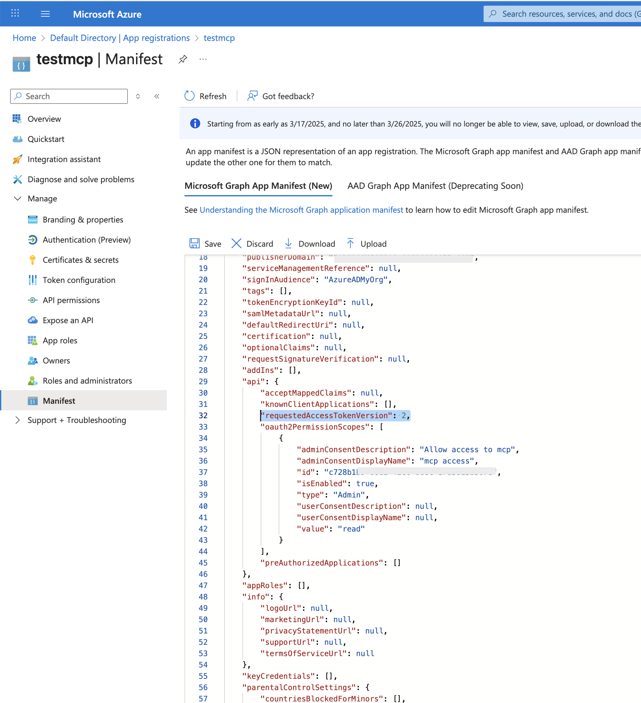
3. Create Client Secret
    - After registration, navigate to Certificates & secrets in your app’s settings.
        - Click “New client secret”
        - Add a description (e.g., “FastMCP Server”)
        - Choose an expiration period
        - Click “Add”
        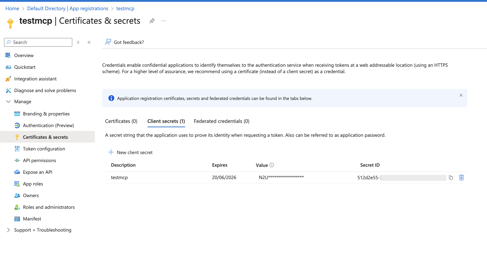
4. Test
    - Set .env
    ```bash
        ENTRA_PROXY_AZURE_CLIENT_ID=YOUR_ENTRA_PROXY_AZURE_CLIENT_ID
        ENTRA_PROXY_AZURE_CLIENT_SECRET=YOUR_ENTRA_PROXY_AZURE_CLIENT_SECRET
        AZURE_TENANT_ID=YOUR_AZURE_TENANT_ID
    ```
    - Start the MCP server
    ```bash
        uv run python -m "agents.openai.07_authentication.auth_mcp_entra_proxy"
    ```
    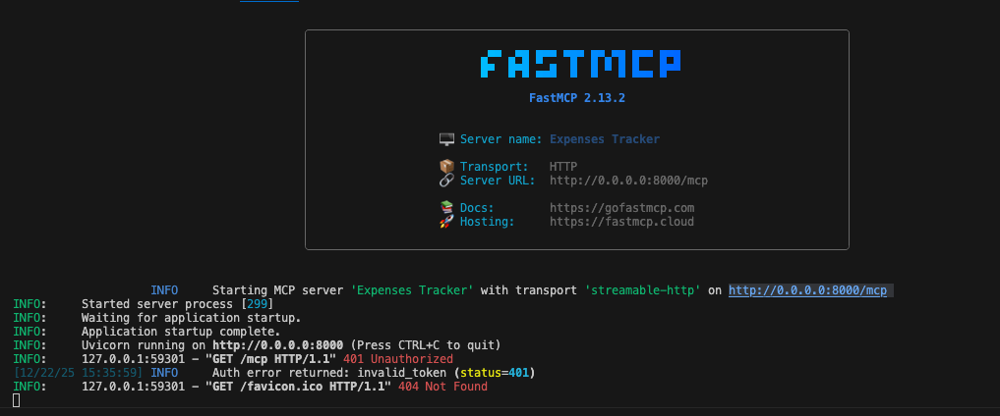
5. Start MCP client in `mcp.json`
    ```bash
        "basic-mcp-http-expenses-client": {
            "type": "http",
            "url": "http://localhost:8000/mcp"
        },
    ```
    - It will open your browser for asking you 'allow access'
        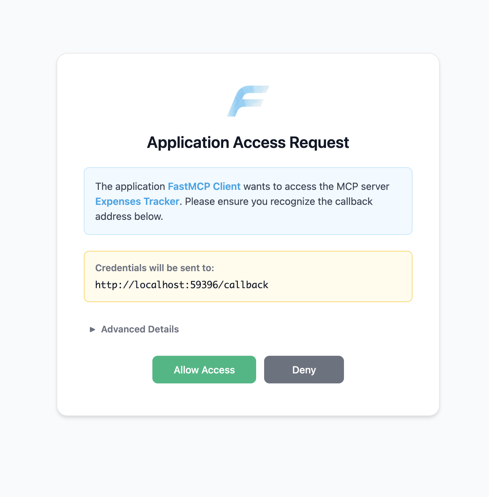
    - It should display an 'Authentication successful' message
        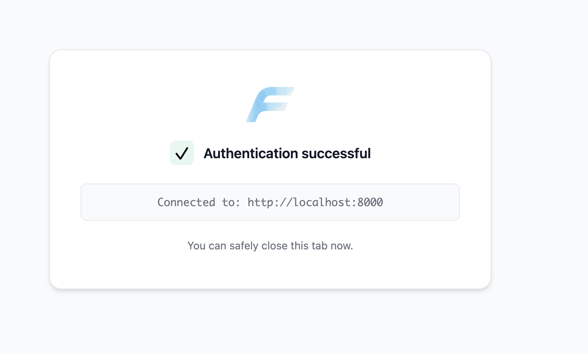
    - Check the logs
        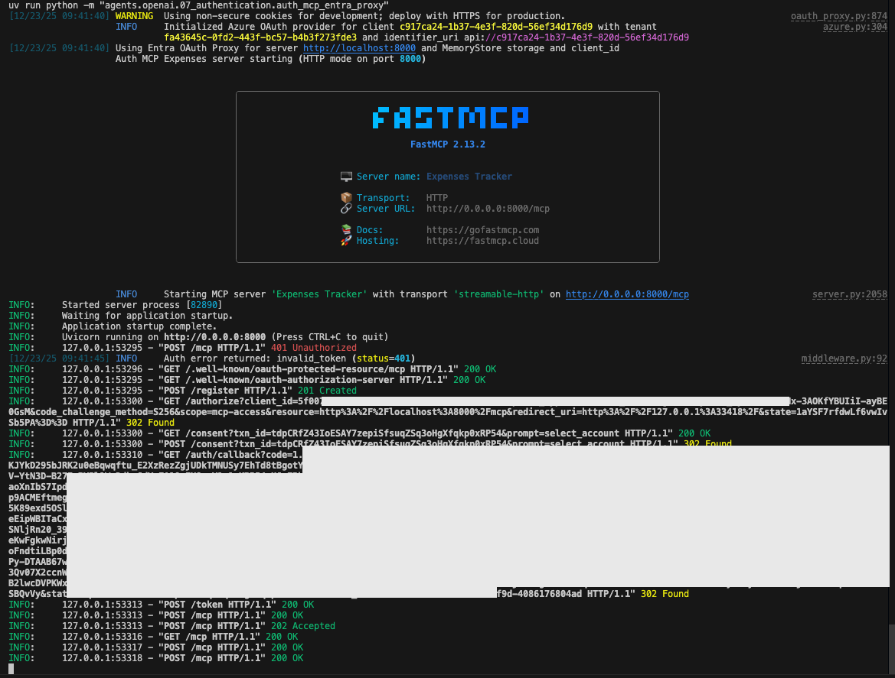

6. Ask to the vscode chat agent: 
    - `Log expense for 75 dollars of office supplies on my visa last Friday`
        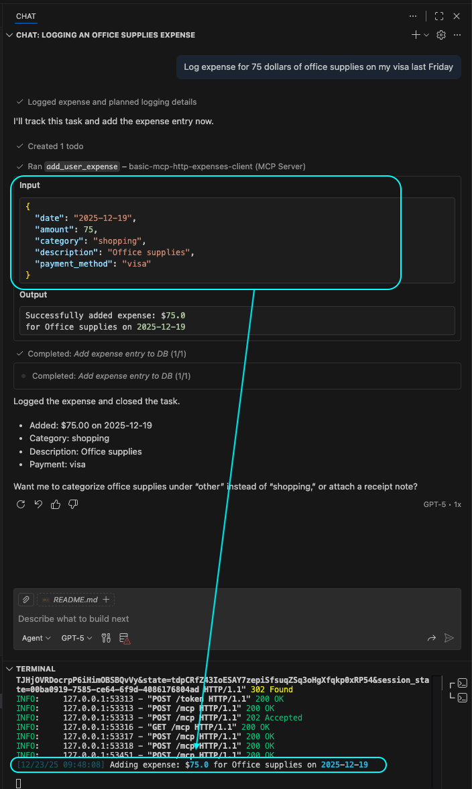
        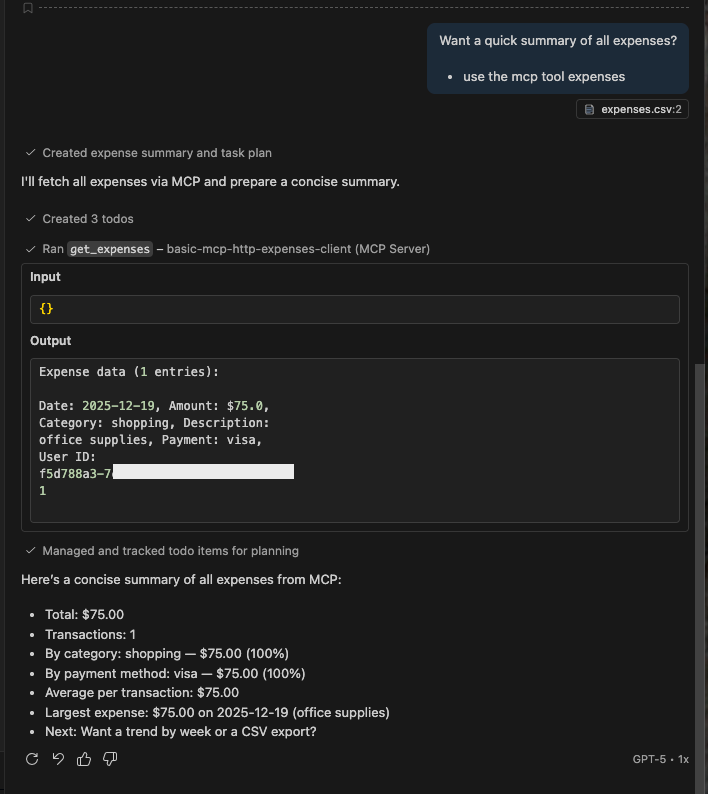


## Troubleshooting

### "Client Not Registered"

If authentication fails for the `basic-mcp-http-expenses-client` in `mcp.json` with a “Client Not Registered” error:

- Verify the client URL in `mcp.json` exactly matches your MCP server (protocol, host, port, and `/mcp` path).
- Ensure the MCP server is running and supports Dynamic Client Registration (DCR).
- Clear cached authentication registrations and restart your IDE and server.
    - VS Code: Open the Command Palette (Ctrl+Shift+P or Cmd+Shift+P) and run `Authentication: Remove Dynamic Authentication Provider`. Delete the server entry matching your MCP server URL.
    - Manual Deletion: Remove the .acli folder or similar configuration/cache folders in your home directory (e.g., ~/.acli or ~/.claude.json).
- Confirm Azure App Registration settings:
    - A scope is defined and consented.
    - Application ID URI is set.
    - `requestedAccessTokenVersion` is 2.
    - Client secret is valid (not expired).
- Retry authentication and approve consent prompts.


az ad app update --id f311cc61-1a5f-42e8-8eee-fc6aa7153a5a --set api='{"requestedAccessTokenVersion":2}'
