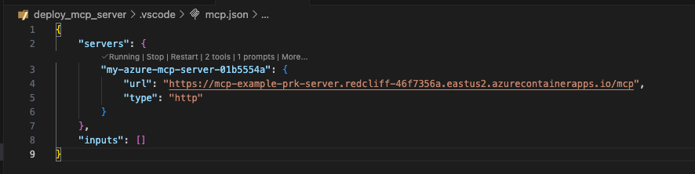

# Azure Deployment Guide - MCP Server

This guide provides comprehensive instructions for deploying a production-ready Model Context Protocol (MCP) server to Azure using Azure Container Apps. The deployment includes an expenses tracking MCP server with OpenTelemetry observability and optional OAuth 2.0 authentication.

## Table of Contents

- [Architecture Overview](#architecture-overview)
- [Prerequisites](#prerequisites)
- [Deployed Azure Resources](#deployed-azure-resources)
- [Quick Start Deployment](#quick-start-deployment)
- [Configuration Options](#configuration-options)
- [Authentication Methods](#authentication-methods)
- [Observability & Monitoring](#observability--monitoring)
- [Advanced Deployment Scenarios](#advanced-deployment-scenarios)
- [Post-Deployment Verification](#post-deployment-verification)
- [Using with GitHub Copilot](#using-with-github-copilot)
- [Local Development](#local-development)
- [Troubleshooting](#troubleshooting)
- [Cost Management](#cost-management)

---

## Architecture Overview

The MCP server is deployed as a containerized application on Azure Container Apps, with the following components:

```
┌─────────────────────────────────────────────────────────────┐
│                    Azure Container Apps                      │
│  ┌──────────────┐  ┌────────────┐  ┌──────────────────┐    │
│  │ MCP Server   │  │  Keycloak  │  │  Agent Service   │    │
│  │ (FastMCP)    │  │ (Optional) │  │  (OpenAI Agent)  │    │
│  └──────┬───────┘  └─────┬──────┘  └────────┬─────────┘    │
│         │                 │                   │              │
└─────────┼─────────────────┼───────────────────┼──────────────┘
          │                 │                   │
          ▼                 ▼                   ▼
┌─────────────────┐ ┌─────────────┐  ┌──────────────────┐
│  Azure Cosmos   │ │ Application │  │  Azure OpenAI    │
│  DB (NoSQL)     │ │  Insights   │  │  (GPT-4o-mini)   │
└─────────────────┘ └─────────────┘  └──────────────────┘
```

### Key Features

- **MCP Server**: FastMCP-based server with tools for expense tracking and analysis
- **Managed Authentication**: Support for OAuth 2.0 (Keycloak or Microsoft Entra ID)
- **Persistent Storage**: Azure Cosmos DB for expense data and OAuth client registrations
- **Full Observability**: OpenTelemetry instrumentation with Azure Application Insights or Logfire
- **AI Agent**: Pre-configured agent using Azure OpenAI for intelligent expense queries
- **Production-Ready**: VNet support, private endpoints, and security best practices

---

## Prerequisites

### Required Tools

1. **Azure Developer CLI (azd)** - [Installation guide](https://learn.microsoft.com/azure/developer/azure-developer-cli/install-azd)
   ```bash
   # Verify installation
   azd version
   ```

2. **Docker** (for local testing) - [Download Docker](https://www.docker.com/get-started)
   ```bash
   docker --version
   ```

3. **Python 3.13+** (for local development)
   ```bash
   python --version
   ```

### Azure Account Requirements

1. **Azure Subscription** - [Create a free account](https://azure.microsoft.com/free/)
2. **Required Permissions**:
   - `Microsoft.Authorization/roleAssignments/write` (Role Based Access Control Administrator, User Access Administrator, or Owner)
   - `Microsoft.Resources/deployments/write` at subscription level
3. **Quota Requirements**:
   - Azure OpenAI access (apply for access if needed)
   - Container Apps quota in your target region

---

## Deployed Azure Resources

When you run `azd up`, the following resources are provisioned:

| Resource | Purpose | SKU/Tier |
|----------|---------|----------|
| **Resource Group** | Contains all resources | - |
| **Azure Container Apps Environment** | Hosts containerized services | Consumption |
| **Azure Container Apps** | MCP server, Keycloak (optional), Agent | Consumption |
| **Azure Container Registry** | Stores container images | Standard |
| **Azure Cosmos DB** | NoSQL database for expenses | Serverless |
| **Azure OpenAI** | AI capabilities for agent | S0 (GPT-4o-mini) |
| **Log Analytics Workspace** | Centralized logging | Pay-as-you-go |
| **Application Insights** | APM and observability (optional) | - |
| **Virtual Network** | Network isolation (optional) | - |
| **Private Endpoints** | Secure connectivity (optional) | - |

### Resource Naming Convention

All resources use a consistent naming pattern:
```
{env-name}-{resource-token}-{resource-type}
```

Example: `my-mcp-abc123-cosmos` for Cosmos DB

---

## Quick Start Deployment

### Basic Deployment (No Authentication)

1. **Login to Azure**:
   ```bash
   azd auth login
   ```
   
   For GitHub Codespaces, use device code flow:
   ```bash
   azd auth login --use-device-code
   ```

2. **Create a new environment**:
   ```bash
   azd env new
   ```
   
   Enter an environment name (e.g., `my-mcp-prod`)

3. **Deploy all resources**:
   ```bash
   azd up
   ```
   
   You'll be prompted to:
   - Select an Azure subscription
   - Choose a primary location (e.g., `eastus`)
   - Choose an OpenAI location (e.g., `eastus2`)
   
   Deployment takes 5-10 minutes.
   
   

4. **Verify deployment**:
   ```bash
   # Check the server URL
   azd env get-value MCP_SERVER_URL
   
   # Test health endpoint
   curl $(azd env get-value MCP_SERVER_URL)/health
   ```


---

## Configuration Options

### Environment Variables

Configure deployment behavior using `azd env set`:

#### Core Settings

```bash
# OpenTelemetry monitoring platform
azd env set OPENTELEMETRY_PLATFORM appinsights  # or logfire, none

# Logfire token (if using Logfire)
azd env set LOGFIRE_TOKEN "your-token"
```

#### Authentication Settings

```bash
# Choose authentication provider
azd env set MCP_AUTH_PROVIDER keycloak    # or entra_proxy, none

# Keycloak configuration (if using Keycloak)
azd env set KEYCLOAK_ADMIN_PASSWORD "SecurePass123!"
azd env set KEYCLOAK_REALM_NAME "mcp"
azd env set KEYCLOAK_MCP_SERVER_AUDIENCE "mcp-server"

# Azure tenant (if using Entra)
azd env set AZURE_TENANT_ID "your-tenant-id"
```

#### Network Security Settings

```bash
# Enable private networking
azd env set USE_VNET true
azd env set USE_PRIVATE_INGRESS true
azd env set USE_PRIVATE_ACR true
azd env set USE_PRIVATE_LOG_ANALYTICS true
```

---

## Authentication Methods

### Option 1: No Authentication (Default)

Best for: Development, testing, trusted internal networks

```bash
azd env set MCP_AUTH_PROVIDER none
azd up
```

### Option 2: Keycloak OAuth 2.0

Best for: Full OAuth 2.0 control, custom identity requirements

**Features**:
- Dynamic Client Registration (DCR)
- Pre-configured MCP realm
- User isolation (user-specific expenses)
- Admin console for user management

**Deployment**:
```bash
azd env set MCP_AUTH_PROVIDER keycloak
azd env set KEYCLOAK_ADMIN_PASSWORD "YourSecurePassword123!"
azd up
```

**Access Admin Console**:
```bash
# Get Keycloak admin URL
azd env get-value KEYCLOAK_ADMIN_CONSOLE

# Login: admin / YourSecurePassword123!
```

**Default Users**:
- `testuser` / `testpass` (demo user)

**Known Limitations** (demo configuration):
- Uses H2 in-memory database (data lost on restart)
- Single replica (no horizontal scaling)
- Development mode (`start-dev`)

### Option 3: Microsoft Entra ID (Azure AD)

Best for: Azure-native deployments, enterprise SSO

**Features**:
- Automatic App Registration creation
- Microsoft Entra ID integration
- CosmosDB for OAuth client persistence
- VS Code OAuth support

**Deployment**:
```bash
azd env set MCP_AUTH_PROVIDER entra_proxy
azd env set AZURE_TENANT_ID "your-tenant-id"
azd up
```

The provisioning hooks will:
1. Create an Entra App Registration
2. Generate a client secret
3. Configure redirect URIs for VS Code and production

**Environment Variables Created**:
- `ENTRA_PROXY_AZURE_CLIENT_ID`
- `ENTRA_PROXY_AZURE_CLIENT_SECRET`

---

## Observability & Monitoring

### Azure Application Insights (Default)

Automatically configured when `OPENTELEMETRY_PLATFORM=appinsights`:

**View Traces**:
```bash
# Open monitoring dashboard
azd monitor
```

**Manual Navigation**:
1. Open Azure Portal
2. Navigate to Resource Group → Application Insights
3. Select "Transaction Search" or "Application Map"

**Key Metrics**:
- HTTP request/response times
- MCP tool invocation traces
- Azure Cosmos DB operations
- Azure OpenAI API calls

### Logfire Integration

Alternative observability platform with enhanced Python support:

**Setup**:
1. Create account at [logfire.io](https://logfire.io/)
2. Get write token from dashboard
3. Configure and deploy:
   ```bash
   azd env set OPENTELEMETRY_PLATFORM logfire
   azd env set LOGFIRE_TOKEN "your-write-token"
   azd up
   ```

**Benefits**:
- Python-native trace visualization
- SQL query analysis
- Structured logging
- Real-time streaming

---

## Advanced Deployment Scenarios

### Private Networking (VNet)

Restrict public access to Azure resources using VNet and private endpoints.

**Configuration**:
```bash
azd env set USE_VNET true
azd env set USE_PRIVATE_INGRESS true
azd env set USE_PRIVATE_ACR true          # ACR private access
azd env set USE_PRIVATE_LOG_ANALYTICS true
azd up
```

**What Changes**:
- ✅ Container Apps accessible via private VNet only
- ✅ Cosmos DB restricted to VNet
- ✅ Azure OpenAI restricted to VNet
- ✅ Private endpoints for all services
- ⚠️ Requires VPN or Bastion for access

**Additional Costs**:
- Virtual Network data processing
- Private DNS Resolver
- Private Endpoints (~$0.01/hour each)

### Multi-Region Deployment

For high availability, configure Cosmos DB with multiple regions:

1. Edit `infra/main.bicep`
2. Add additional locations:
   ```bicep
   locations: [
     { locationName: location, failoverPriority: 0 }
     { locationName: 'westus', failoverPriority: 1 }
   ]
   ```
3. Deploy: `azd up`

---

## Post-Deployment Verification

### 1. Health Check


```bash
# Get server URL
SERVER_URL=$(azd env get-value MCP_SERVER_URL)

# Test health endpoint
curl $SERVER_URL/health
# Expected: {"status":"healthy","service":"mcp-server"}
```

### 2. View Deployed Resources


```bash
# List all resources
az resource list --resource-group $(azd env get-value AZURE_RESOURCE_GROUP_NAME) --output table
```

### 3. View Deployment Details


Navigate to Azure Portal → Resource Group → Deployments to see the complete deployment history.

### 4. Check Container App


```bash
# View logs
az containerapp logs show \
  --name $(azd env get-value AZURE_CONTAINER_APP_NAME) \
  --resource-group $(azd env get-value AZURE_RESOURCE_GROUP_NAME) \
  --follow
```

---

## Using with GitHub Copilot

### Add MCP Server to VS Code

1. **Disable conflicting servers**:
   - Stop local MCP servers from `mcp.json`
   - Disable duplicate expense tools

2. **Add server**:
   - Open Command Palette: `MCP: Add Server`
   - Select **HTTP** as server type
   - Enter server URL:
     ```bash
     azd env get-value MCP_SERVER_URL
     ```

    

3. **For OAuth-enabled deployments**:
   - Browser will open for authentication
   - Sign in with Keycloak or Microsoft account
   - Grant access permissions
   - Browser redirects back to VS Code

4. **Enable tools**:
   - Open GitHub Copilot Chat
   - Enable MCP server tools

    

### Test with Sample Queries

```text
# Add an expense
Log expense for 75 dollars of office supplies on my visa last Friday

# View expenses
Show me my expenses from last week

# Analysis
Analyze my spending patterns for the month and suggest budget optimizations
```


### Check data in CosmosDB


### Check App container

**Environment variables:**


**Logs:**
