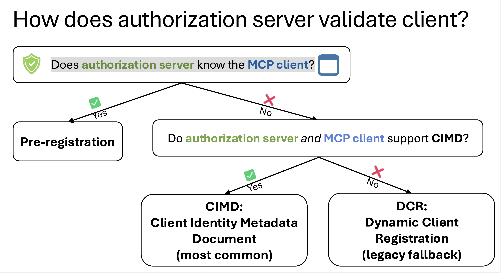

# MCP Authentication

See [PythonMCP-Authentication.pdf](./PythonMCP-Authentication.pdf)

## Table of Contents

- [MCP Authentication](#mcp-authentication)
    - [Table of Contents](#table-of-contents)
    - [Doco](#doco)
    - [Example](#example)
    - [Authorization Server Client Validation Flow (MCP)](#authorization-server-client-validation-flow-mcp)
        - [High-Level Question](#high-level-question)
        - [Client Validation Models](#client-validation-models)
            - [Pre-registration (Client Pre-Registration)](#pre-registration-client-pre-registration)
            - [CIMD — Client Identity Metadata Document](#cimd--client-identity-metadata-document)
            - [DCR — Dynamic Client Registration](#dcr--dynamic-client-registration)
            - [Client Validation Models Comparison](#client-validation-models-comparison)
            - [Summary](#summary)
        - [Decision Flow Overview](#decision-flow-overview)
            - [1. Authorization Server Knows the MCP Client ✅](#1-authorization-server-knows-the-mcp-client-)
            - [2. Authorization Server Does *Not* Know the MCP Client ❌](#2-authorization-server-does-not-know-the-mcp-client-)
                - [2.1 CIMD Supported (Recommended / Most Common) ✅](#21-cimd-supported-recommended--most-common-)
                - [2.2 CIMD Not Supported ❌](#22-cimd-not-supported-)
            - [Summary Table](#summary-table)
            - [Key Takeaways](#key-takeaways)
            - [Related Concepts](#related-concepts)

## Doco

- [OAuth-based access flow](https://modelcontextprotocol.io/specification/2025-11-25/basic/authorization)

## Example

- [Deploying Azure Function with key access](https://github.com/Azure-Samples/mcp-sdk-functions-hosting-python)
- [Tavily - Agent Framework](../agents/agentframework_tavily.py)
- [Tavily - Langchain](../agents/langchainv1_tavily.py)

## Authorization Server Client Validation Flow (MCP)

### High-Level Question

**Does the Authorization Server know the MCP client?**

This single question determines the entire validation path.

- Pre-registration
- CIMD — Client Identity Metadata Document
- DCR - Dynamic Client Registration(legacy fallback)

---

### Client Validation Models

#### Pre-registration (Client Pre-Registration)

Pre-registration is the model where an authorization server already knows and trusts a client before any runtime interaction occurs.

In this approach, the client’s identity and security settings are manually or administratively configured on the authorization server ahead of time.

##### What Pre-registration Is

Pre-registration means:

- The client is explicitly created in the authorization server
- All client metadata is stored server-side
- No discovery or dynamic onboarding happens at runtime

In the flow you shared, this corresponds to:

`"Does the authorization server know the MCP client?” → Yes`

##### What Is Stored During Pre-registration

Typical pre-registered client metadata includes:

- client_id
- Allowed grant types
- Token endpoint authentication method
- Redirect URIs (if applicable)
- Public keys or client secrets
- Scopes and permissions
- Trust level / policy bindings

Example (conceptual):
```json
{
  "client_id": "mcp-internal-client",
  "grant_types": ["client_credentials"],
  "token_endpoint_auth_method": "private_key_jwt",
  "jwks": { ... },
  "scopes": ["mcp.read", "mcp.write"]
}
```

##### How Pre-registration Works (Step by Step)

1. Client is onboarded
   - Manually via admin UI, config file, or IaC
2. Authorization server stores client metadata
3. Client authenticates
   - Using configured credentials (e.g. mTLS, private_key_jwt)
4. Authorization server validates client
   - Looks up client_id
   - Verifies credentials
5. Tokens are issued
   - No discovery. No registration. No negotiation.

##### When Pre-registration Is Used

Pre-registration is ideal for:

- Internal MCP clients
- First-party services
- Long-lived integrations
- Highly regulated environments
- Closed ecosystems

Common in:

- Enterprise IAM platforms
- Banking and financial systems
- Government systems
- Platform-owned MCP deployments

---

#### CIMD — Client Identity Metadata Document

CIMD is a standardized way for an authorization server to discover, identify, and trust a client dynamically, without requiring prior registration.

In simple terms:

`CIMD answers the question “Who is this client?” in a verifiable, machine-readable way.`

##### What CIMD Is

A Client Identity Metadata Document is a publicly accessible metadata file published by a client (for example, an MCP client).
It describes the client’s identity, capabilities, and security properties.

[VS Code example](https://vscode.dev/oauth/client-metadata.json)

The authorization server:

1. Fetches this document
2. Validates its integrity and origin
3. Uses it to make trust and authorization decisions

##### Why CIMD Exists

Traditional OAuth assumes:

- Clients are pre-registered or
- Clients dynamically register themselves (DCR)

Both approaches have limitations at scale.

**CIMD solves this by enabling:**

- Decentralized client identity
- Zero-touch onboarding
- Stronger cryptographic trust
- Better interoperability across domains

---

#### DCR — Dynamic Client Registration

Dynamic Client Registration (DCR) is a mechanism that allows a client to register itself at runtime with an authorization server in order to obtain a client identity.

In short:

`DCR answers “How can an unknown client become known?”`

##### What DCR Is

With DCR:

- The client is not known in advance
- The client sends a registration request to the authorization server
- The authorization server creates a new client entry dynamically
- Client credentials are issued on the fly

DCR is defined in OAuth 2.0 Dynamic Client Registration (RFC 7591).

##### Why DCR Exists

DCR was introduced to:

- Reduce manual client onboarding
- Support large numbers of third-party clients
- Enable self-service registration

It was especially useful before discovery-based identity models (like CIMD) became common.

##### How DCR Works (Step by Step)

1. Client sends registration request
   - POST to the registration endpoint
   - Includes redirect URIs, grant types, metadata
2. Authorization server validates the request
   - May require an initial access token
   - Applies local policies
3. Client is created
   - A new client_id is generated
   - Often a client_secret is issued
4. Registration response returned
   - Client stores credentials
   - Uses them for token requests

Example (simplified):

**Registration Request**
```json
{
  "redirect_uris": ["https://client.example.com/callback"],
  "grant_types": ["client_credentials"],
  "token_endpoint_auth_method": "client_secret_basic"
}
```
**Registration Response**
```json
{
  "client_id": "generated-client-id",
  "client_secret": "generated-secret",
  "client_id_issued_at": 1730000000
}
```

--- 

#### Client Validation Models Comparison

| Dimension | Pre-registration | CIMD (Client Identity Metadata Document) | DCR (Dynamic Client Registration) |
|---------|------------------|------------------------------------------|-----------------------------------|
| Does authorization server know the client upfront? | Yes | No | No |
| Client onboarding | Manual / administrative | Automatic (discovery-based) | Automatic (registration-based) |
| Client identity source | Authorization server database | Client-published metadata document | Authorization server-generated |
| Trust model | Explicit, static trust | Cryptographic, decentralized trust | Server-centric, policy-based trust |
| Client credentials | Pre-configured (keys, mTLS, JWT) | Client-owned keys (JWKS) | Issued by authorization server |
| Runtime registration | Not required | Not required | Required |
| Discovery required | No | Yes | No |
| Credential issuance at runtime | No | No | Yes |
| Authorization server state | High | Low | High |
| Scalability | Low–medium | High | Medium |
| Operational overhead | High | Low | Medium |
| Security posture | Very strong, tightly controlled | Strong, modern, zero-trust aligned | Adequate but weaker than CIMD |
| Typical auth methods | mTLS, private_key_jwt | private_key_jwt, mTLS | client_secret, mTLS |
| Best suited for | Internal / first-party clients | Federated, large-scale MCP ecosystems | Legacy or transitional systems |
| Modern recommendation | Valid but limited | **Preferred / most common** | Fallback only |
| Role in decision flow | First choice if client is known | Default for unknown modern clients | Legacy fallback |

### Summary

- **Pre-registration** prioritizes control and certainty but does not scale well.
- **CIMD** enables decentralized, scalable, and cryptographically strong client identity and is the preferred modern approach.
- **DCR** provides backward compatibility but should be treated as a legacy fallback when CIMD is unavailable.


---

### Decision Flow Overview



#### 1. Authorization Server Knows the MCP Client ✅

If the authorization server already knows the MCP client:

- The client has been **pre-registered**
- Client identifiers and metadata already exist
- No runtime discovery or registration is required

**Result:**  
➡️ **Pre-registration flow is used**

This is common in:
- Enterprise integrations
- First-party or partner MCP clients
- Controlled deployment environments

---

#### 2. Authorization Server Does *Not* Know the MCP Client ❌

If the client is unknown, the server must determine how to learn the client’s identity.

This leads to the next decision.

---

##### 2.1 CIMD Supported (Recommended / Most Common) ✅

CIMD is a standardized way for an authorization server to discover, identify, and trust a client dynamically, without requiring prior registration.

If **both the Authorization Server and the MCP client support CIMD**:

**CIMD = Client Identity Metadata Document**

- The MCP client publishes a metadata document
- The authorization server fetches and validates it
- Client identity is established dynamically and securely

**Result:**  
➡️ **CIMD-based client validation**

This is the **most common and modern approach**, enabling:
- Decentralized client identity
- Better scalability
- Reduced manual registration

---

##### 2.2 CIMD Not Supported ❌

If CIMD is not supported by either side:

**Fallback mechanism is used**

**DCR = Dynamic Client Registration**

- Client registers itself at runtime
- Authorization server issues client credentials
- Typically requires additional trust controls

**Result:**  
➡️ **Dynamic Client Registration (legacy fallback)**

This approach is considered legacy and is mainly used for:
- Backward compatibility
- Older OAuth deployments

---

#### Summary Table

| Scenario | Resulting Flow |
|--------|---------------|
| Authorization server already knows the MCP client | Pre-registration |
| Unknown client + CIMD supported | CIMD (Client Identity Metadata Document) |
| Unknown client + CIMD not supported | DCR (Dynamic Client Registration) |

---

#### Key Takeaways

- The **authorization server does not always know the MCP client upfront**
- When it does → pre-registration is sufficient
- When it does not:
  - **CIMD is the preferred and most common solution**
  - **DCR is a legacy fallback**
- The entire model prioritizes **secure, scalable, and decentralized client identity**

---

#### Related Concepts

- OAuth 2.0 / OAuth 2.1
- MCP (Model Context Protocol)
- Client Identity Metadata
- Zero-trust authorization patterns

